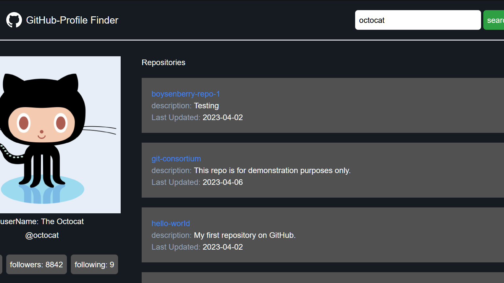

## Github Profile Finder

A web application that allows users to search and view Github profiles easily. The application displays information such as the user's repositories, repository count, followers, following, and login id.

### Screenshots

Here are some screenshots of the Github Profile Finder in action:

### Live Demo

You can view a live demo of the Github Profile Finder [https://github-profile-finder-ineuron.netlify.app/](https://github-profile-finder-ineuron.netlify.app/).

### Installation

To install and run the Github Profile Finder locally, follow these steps:

1. Clone the repository: `git clone https://github.com/samhithMR/Github-Profile-Finder.git`

### Technologies Used

The Github Profile Finder was built using the following technologies:

- HTML
- Tailwind CSS
- JavaScript

